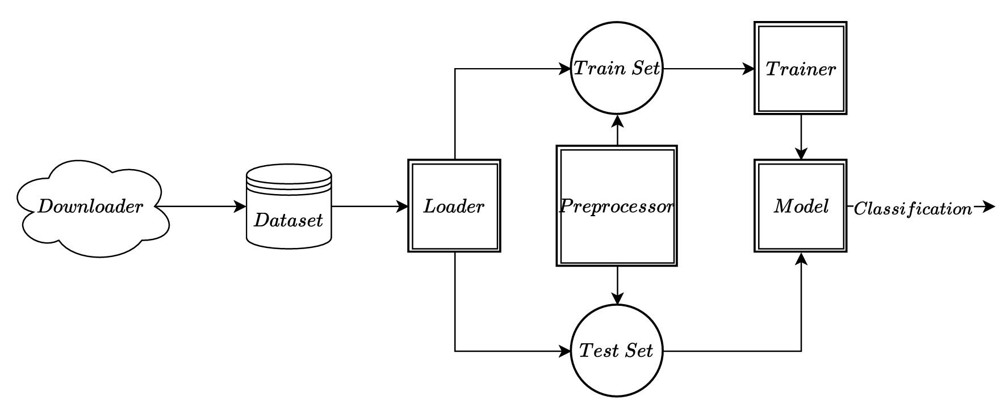

# Music Genres Classification - System Architecture

## System Overview
The **Music Genres Classification** is a deep learning-based system designed to classify audio tracks into different genres using **Convolutional Neural Networks (CNNs)**. The system processes raw audio signals into feature-rich representations like **Mel-Frequency Cepstral Coefficients (MFCCs)**, enabling robust classification. Each module in the system plays a crucial role, from data acquisition to model training and evaluation.

## **Downloader: Dataset Acquisition**
The **Downloader** module is responsible for fetching the **GTZAN** dataset from the internet. The **GTZAN** dataset is a collection of 1,000 audio tracks, each 30 seconds long, organized into 10 music genres, with 100 tracks per genre. The genres included are:
- Blues
- Classical
- Country
- Disco
- Hip-Hop
- Jazz
- Metal
- Pop
- Reggae
- Rock

The **Downloader** ensures that the dataset is properly structured and ready for preprocessing. This module verifies data integrity, extracts files if necessary, and organizes them into appropriate directories for further processing.

## **Preprocessor: Feature Extraction**
The **Preprocessor** module converts raw audio signals into feature representations that are suitable for machine learning. This involves:
- **Spectrogram Generation:** Computes time-frequency representations of the audio signals.
- **MFCC Extraction:** Derives perceptually relevant features for genre classification.

## **Dataset: Data Handling**
The **Dataset** provides an efficient interface for accessing audio samples. This module:
- Loads audio files and applies preprocessing techniques.
- Pairs transformed **MFCCs** along with their corresponding genre labels.
- Ensures that the dataset is compatible with **Loader** for efficient batch processing.

## **Loader: Dataset Loading**
The **Loader** component is responsible for managing the dataset and preparing it for efficient processing during training and evaluation. It interacts with the **Dataset**, which performs real-time preprocessing. The Loader is tasked with:
- **Batch Loading:** Retrieves batches of audio data from the **Dataset** in an efficient manner for training.
- **Data Shuffling:** Ensures that the data is shuffled to improve model generalization and prevent overfitting.
- **Providing Data for Training and Evaluation:** Supplies the necessary features (**MFCCs**) and corresponding labels to the **Trainer** for model training and evaluation.

## **Model: CNN Architecture**
The **Model** module defines the **Convolutional Neural Network (CNN)** used for classification. Key components include:
- **Convolutional Layers:** Extract spatial features from **MFCCs**.
- **Batch Normalization & Dropout:** Improve generalization and training stability.
- **Fully Connected Layers:** Map extracted features to genre predictions.
- **Softmax Output:** Provides class probabilities for each genre.

## **Trainer: Model Training & Evaluation**
The **Trainer** module is responsible for optimizing the **CNN** model. It includes:
- **Training Pipeline:** Backpropagation and gradient updates.
- **Loss Function:** Cross-entropy loss for multi-class classification.
- **Performance Metrics:** Tracks accuracy, precision, recall, and loss trends.
- **Validation & Testing:** Evaluates the model on unseen data to measure generalization performance.
- **Checkpointing & Logging:** Saves model states and logs training progress for reproducibility.

## Conclusion
This structured approach ensures modularity and scalability, allowing for efficient dataset handling, feature extraction, model training, and evaluation. By leveraging **CNNs** on **MFCC** representations, the system achieves high-performance music genre classification.

## Next Steps
For a more in-depth look into the mathematical principles behind specific components, see the [Mathematical Background](MATH.md).

For general project information, see the [README](../README.md).
