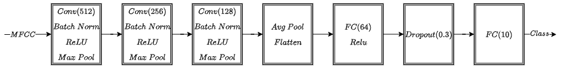
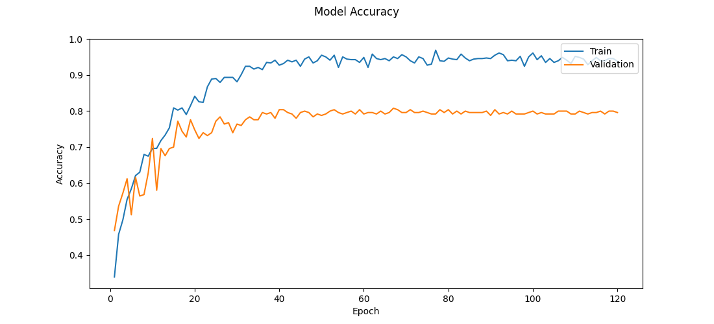

# Music Genres Classification - CNN Architecture

## Architecture Overview
The **Convolutional Neural Network (CNN)** used in the Music Genres Classification project is designed to process 2D feature maps extracted from audio signals, such as **MFCCs**.

The network is built from three main convolutional blocks that gradually extract higher-level features from the input, followed by fully connected layers that perform the final classification. Each convolutional block reduces the spatial size of the input while increasing the richness of the feature representation.

### Convolutional Blocks
#### First Block
The first block starts by expanding the input into $512$ feature maps. This block captures low-level patterns in the audio representation, such as basic frequency structures and short-term temporal patterns. After feature extraction, a max pooling operation reduces the size of the feature maps, allowing the network to focus on the most important information while lowering computational cost.

#### Second Block
The second block refines the features from the first block, decreasing the number of feature maps to $256$. This stage begins to combine the basic patterns into more complex audio features, such as rhythmic structures or harmonic combinations. Another max pooling operation further compresses the spatial size.

#### Third Block
The third block produces $128$ feature maps. At this stage, the network identifies more abstract and genre-specific patterns, combining the earlier learned structures into distinctive genre signatures. The final max pooling in this block creates a compact yet informative representation of the input.

### Linear Layers
#### Flattening
After the convolutional blocks, the spatial feature maps are passed through an adaptive average pooling layer. This layer computes the average of each feature map, reducing each channel to a single value regardless of the input dimensions. The resulting tensor is then flattened into a one-dimensional vector per sample, which serves as a compact representation of all the extracted features.

#### First Layer
The flattened vector is passed to the first fully connected layer, which reduces the feature dimensionality to $64$ key features. This layer distills the essential patterns learned by the convolutional blocks into a concise, high-level representation suitable for subsequent layers.

#### Dropout Layer
A dropout layer helps prevent overfitting by randomly disabling some neurons ($30\%$) during training, which encourages the network to learn more robust and generalizable features. This also reduces the risk of the model relying too heavily on specific connections between neurons.

#### Classification Layer
The final fully connected layer outputs $10$ values, each corresponding to one music genre. These values are the raw logits; during inference, they can be converted into probabilities using a softmax function.

## Process Flow
- **Input:** A 2D representation of the audio is fed into the network.
- **Feature Extraction:** Three convolutional blocks progressively extract and refine features.
- **Flattening:** The 2D features are transformed into a 1D vector.
- **Feature Reduction:** The fully connected layer compresses information into 64 features.
- **Classification:** The final layer produces probabilities for each of the ten genres.

## Training Process
The training pipeline is designed to optimize the CNN for high classification accuracy while ensuring generalization to unseen audio samples.

### Dataset Splitting
The dataset is divided into three subsets:
- **Training Set:** $65\%$ of the data, used for learning the network parameters.
- **Validation Set:** $25\%$ of the data, used to tune hyperparameters and monitor overfitting.
- **Test Set:** $10\%$ of the data, used only for final performance evaluation.

### Training Procedure
- **Epochs:** The network is trained for $120$ epochs.
- **Loss Function:** **Cross-entropy loss** is used to measure the difference between predicted and actual genres.
- **Optimizer:** Adaptive optimization techniques (i.e., **Adam**) are applied to efficiently update network weights.
- **Evaluation:** After each epoch, performance is measured on the validation set. The best-performing model (based on validation accuracy) is saved.

### Training and Validation Trends
The following plot shows the training and validation accuracy across epochs, providing insight into learning progress and model convergence:

## Conclusion
This CNN architecture, combined with a well-structured training process and balanced dataset splits, effectively learns to distinguish between ten music genres from **MFCC**-based audio representations. By progressively extracting features through convolutional blocks, refining them in fully connected layers, and validating performance over multiple epochs, the model achieves strong classification accuracy while maintaining good generalization to unseen data.

## Next Steps
For details on testing and validation methods used in this system, see [Testing & Validation](TESTING.md).

For a more in-depth look into the mathematical principles behind specific components, see the [Mathematical Background](MATH.md).
