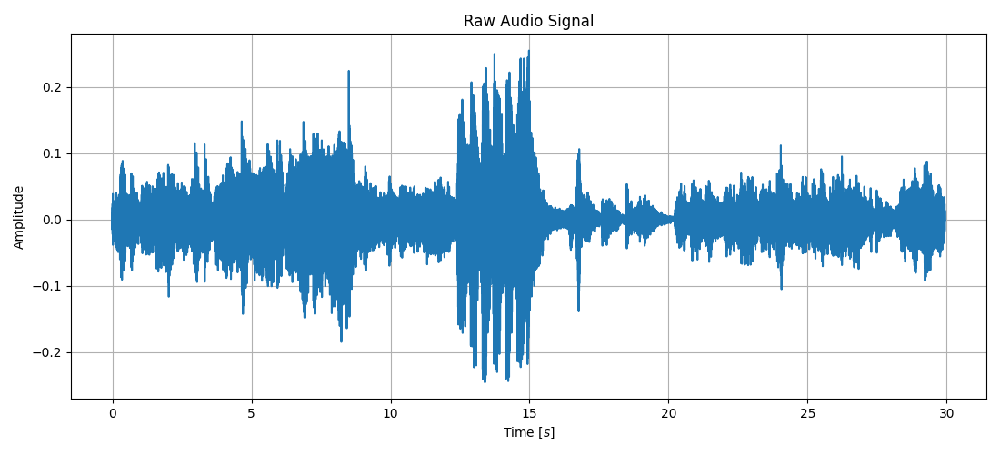
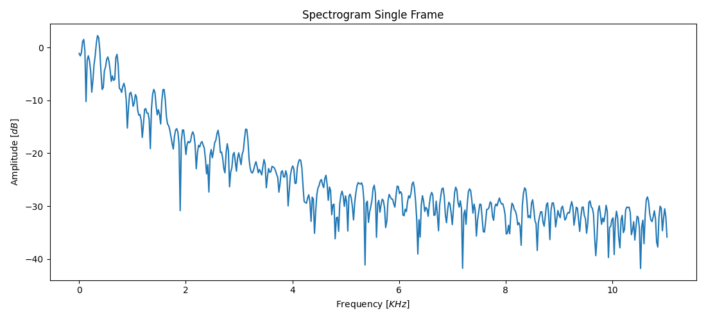
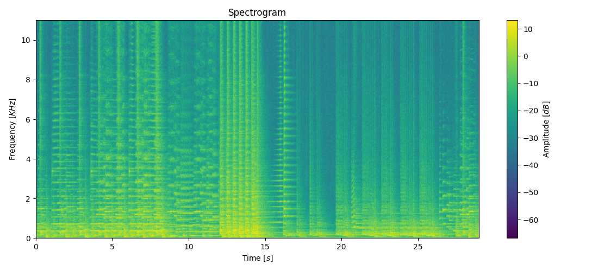
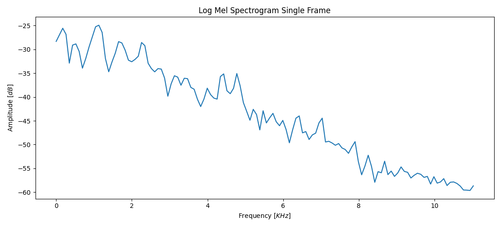
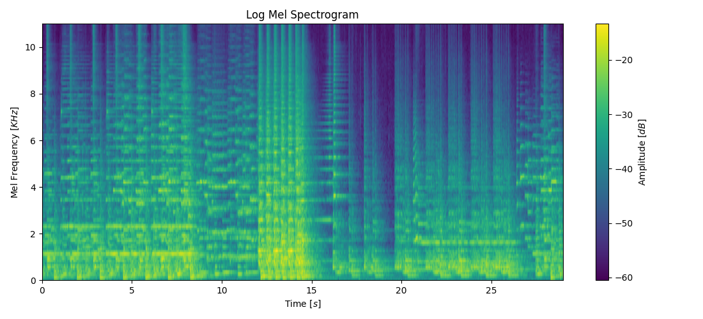
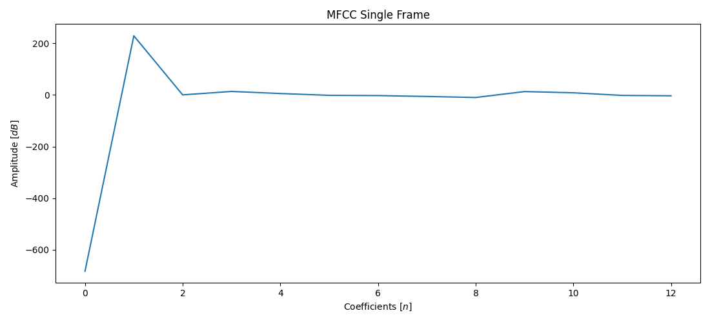
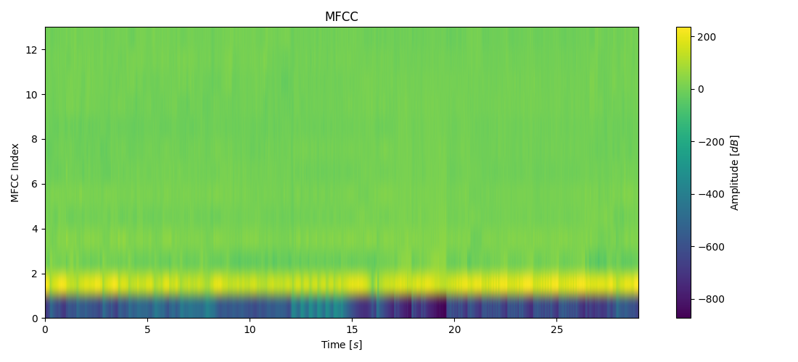

# Music Genres Classification - Mathematical Background

## **Preprocessor**
The **Preprocessor** is responsible for transforming raw audio signals into features that can be used for training the model. This includes tasks like generating the **spectrogram**, **log-mel spectrogram**, and **MFCCs**. The preprocessing steps help convert the audio data into a format that captures important characteristics of the sound while reducing irrelevant noise.

### **Audio Signal & Spectrogram**
An audio signal is typically represented as a time series of samples. For a digital signal with a given sampling rate
$f_s$, the signal is discretized into $N$ samples over time.

The **spectrogram** is a 2D representation of the signal's frequency content over time, often computed by performing the **Short-Time Fourier Transform (STFT)**. The **STFT** of a signal is defined as:

$$X(t,\ f) = \sum_{n=-\infty}^{\infty}x[n]\cdot w[n-t]\cdot e^{-j2\pi fn}$$

Where:
- $x[n]$ is the input signal
- $w[n]$ is the window function (e.g., Hamming, Hanning)
- $t$ is the time index
- $f$ is the frequency index
- $e^{-j2\pi fn}$ represents the frequency components

The output of the **STFT** is typically a complex-valued matrix, from which the magnitude (or power) is taken to form the spectrogram.

$$S(t,\ f) = |X(t,\ f)|^2$$

This spectrogram represents the time-varying frequency content of the signal.

### **Log-Mel Spectrogram**
The **Mel Spectrogram** is obtained by mapping the frequency bins from the linear scale to the **Mel scale**, which smoothes the linear **spectrogram** and approximates the human ear's perception of pitch. The process can be broken down into the following steps:

#### **1. Fourier Transform**
We begin by calculating the **spectrogram** (or **STFT**) of the signal as described above.

#### **2. Mel Filterbank**
A Mel filterbank is a set of filters designed to approximate the human ear's sensitivity to different frequencies. The Mel scale is given by the following formula:

$$f_{mel} = 2595 \cdot \log_{10}(1 + \frac{f}{700})$$

Where:
- $f$ is frequency in $Hz$
- $f_{mel}$ is the frequency in **Mel scale**

The **Mel filterbank** is constructed by spatially distributing filters across the Mel scale, typically using triangular filters. These filters are applied to the linear **spectrogram** to extract **Mel-scaled** features.

#### **3. Applying the Mel Filterbank**
The **Mel-scaled spectrogram** $S_{mel}$ is obtained by multiplying the **spectrogram** $S(t,\ f)$ by the **Mel filterbank** matrix $H$:

$$S_{mel}(t,\ m) = \sum_{f}S(t,\ f)\cdot H(f,\ m)$$

Where:
- $S(t,\ f)$ is the original spectrogram.
- $H(f,\ m)$ is the Mel filterbank matrix
- $S_{mel}(t,\ m)$ is the Mel-scaled spectrogram

#### **4. Logarithmic Scaling**
The **Mel spectrogram** is then typically converted to a logarithmic scale to better represent the intensity of the signal and to match human auditory perception:

$$S_{mel_{log}}(t,\ m) = \log_{10}(S_{mel}(t,\ m) + \epsilon)$$

Where $\epsilon$ is small constant added to avoid $\log(0)$.

### **MFCC (Mel-Frequency Cepstral Coefficients)**
The **MFCC** extraction process begins after obtaining the **log-mel spectrogram**. MFCCs are a representation of the short-term power spectrum of sound, designed to mimic the human auditory system. The steps involved in computing MFCCs are:

#### **1. Discrete Cosine Transform (DCT)**
The first step is to apply the **Discrete Cosine Transform (DCT)** to the **log-mel spectrogram** to compress the data and remove redundancy:

$$C_m = \sum_{n=0}^{M-1}S_{mel_{log}}(n)\cdot \cos(\frac{\pi m}{M}\cdot (n + 0.5))$$

Where:
- $C_m$ are the resulting **MFCC coefficients**
- $M$ is the number of coefficients
- $n$ is the Mel frequency bin index
- $m$ is the index for the **MFCCs**

Typically, the first few coefficients are retained, as they capture the most significant features.

## **Trainer**
The **Trainer** component is responsible for the training of the neural network. Training involves the process of optimizing the model’s parameters using the training data to minimize the error in the model’s predictions.

### **Forward Propagation**
During the **forward propagation**, the features (**spectrogram** and **MFCCs**) are passed through the **CNN**. The output from the final layer is the predicted class probabilities for the given input sample. The output of the model, denoted as $y_{pred}$, can be calculated as:

$$y_{pred} = f_model(X)$$

Where:
- $y_pred$ is the predicted output (e.g., genre probabilities)
- $X$ represents the input features
- $f_model$ is the model function (which includes layers such as convolutional, pooling, and dense layers)

### **Loss Function**
The **Loss Function** is used to compute the error between the model’s predicted output and the true label $y_{true}$. For a classification problem, the **cross-entropy loss** is used, which is given by:

$$L(y_{true},\ y_{pred}) = \sum_{c=1}^{C}y_{true}(c)\cdot \log(y_{pred}(c))$$

Where:
- $L$ is loss
- $C$ is the number of classes
- $y_{true}(c)$ is the true label for class $c$
- $y_{pred}(c)$ is the predicted probability for class $c$

### **Backpropagation**
During **backpropagation**, the **loss function** is differentiated with respect to the model’s weights and biases. This gradient is then used to adjust the model parameters via an optimization algorithm **Adam (Adaptive Moment Estimation)**:

- **1. Compute Gradients**

$$g_t = \frac{\partial L}{\partial w_t}$$

- **2. Update First Moment Estimate (mean of the gradients):**

$$m_t = \beta_1 \cdot m_{t-1} + (1-\beta_1)\cdot g_t$$

- **3. Update Second Moment Estimate (variance of the gradients):**

$$v_t = \beta_2 \cdot v_{t-1} + (1-\beta_2)\cdot g_t^2$$

- **4. Bias Correction:**

$$\hat{m_t} = \frac{m_t}{1 - \beta_1^2},\ \hat{v_t} = \frac{v_t}{1 - \beta_2^2}$$

- **4. Update Parameter:**

$$w_t = w_{t-1} - \lambda \cdot \frac{\hat{m}}{\sqrt{\hat{v_t}} + \epsilon}$$

This process is repeated for a number of iterations (epochs) until the model converges to a solution where the loss is minimized.

## Conclusion
Outlined mathematical steps behind the generation of the **spectrogram**, **log-mel spectrogram** and **MFCCs** form the foundation for how raw audio is transformed into a form that can be processed by machine learning algorithms. Training process, including forward propagation, loss computation, and backpropagation, represents the core of the optimization process, allowing the model to learn from the training data and improve its accuracy over time.

## Next Steps
For a more in-depth look into the **CNN** architecture, see [CNN Architecture](CNN.md).

For a detailed breakdown of the system’s architecture, see the [System Architecture](ARCHITECTURE.md).
